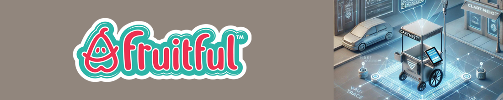

<p align="center">
  
</p>

# VaultMesh

**Ecosystem control terminal & brand-management portal — Fruitful™ / FAA.Zone**
`heyns1000/vaultmesh` · HTML · JavaScript

> Factual header added 13 June 2026, verified against live GitHub via the
> `fruitful-ecosystem-auditor` skill. Every file in this repo was read directly.
> The original profile README ("Baobab Bush Portal") is preserved in full below
> the divider; only demonstrably false figures are corrected here.

## Repository facts (verified)

| Metric | Value |
|---|---|
| Default branch | `main` |
| Branches | 4 (`main`, `v3-integrated`, `copilot/add-bad-boys-song-certification`, `claude/review-repos-heatmap-planning`) |
| Files on `main` | 14 |
| Primary languages | HTML + embedded JavaScript |
| Largest pages | `fruitful-brand-packages.html` (208 KB), `heyns.html` (199 KB), `index.html` (107 KB), `products.html` (102 KB) |
| Deploy target | `vaultmesh.faa.zone` (Vercel; Jekyll-docker CI present) |

## What this repo actually is

The "VaultMesh" name is used elsewhere in the ecosystem to describe a
cryptographic backbone. **This repository is not that backbone.** It is the
front-end **control terminal** for the Fruitful™ / FAA.Zone ecosystem: a set of
large, self-contained HTML pages (each with embedded JavaScript, Tailwind, and
Chart.js) that act as the operator's gateway into every other system.

It is a static portal in delivery — there is no server in this repo — but it is
substantial in function. The pages wire together accounting, hosting, commerce,
AI, payments, and the ecosystem's other portals into one dashboard surface.

## The VaultMesh system (in depth)

### `index.html` — the control terminal (107 KB)

The main terminal. Beyond branding, it carries a centralised configuration
object and a live operations map (Google Maps + Chart.js analytics). Its
sections include: AI-Powered Insights, Global Collaboration, Secure VaultMesh™,
Real-time Analytics, **OmniScroll Integration**, **FAA™ Share Signal**, Seedwave
Brand Growth, **Founder's Glyph™**, **Sector Terminals**, **Sector Scrolls**,
**Treaty System™**, and an Executive Summary + Index. It also enumerates global
hubs (Johannesburg, Cape Town, New York).

The terminal links out to the real operational stack the business runs on:

- **Accounting / ops:** SageOne, Hetzner, Cloudflare, Zoho, Vercel.
- **Commerce channels:** Alibaba dropshipping, Takealot sellers, PayPal.
- **AI:** Google Gemini.
- **Ecosystem portals:** Seedwave admin (`admin_panel_xero.html`,
  `ecosystem-dashboard.html`, `login`, `signup`), OmniGrid, SamFox, Banimal,
  Baobab, HomeMart, Fruitful Crate Dance, and the FAA.Zone legal / SecureSign
  pages.

### `heyns.html` — the founder / admin console (199 KB)

The largest operator page. Holds the same centralised credential/config block
as `index.html` and serves as the personal admin console.

### `fruitful-brand-packages.html` — brand management (208 KB)

The brand-management surface: an admin portal to **add new brands and
subnodes**, a **FAA.ZONE Global Index — Core Brands Overview**, real-time
"FAA Pulse" metrics (Active Nodes, Licenses Active, Vault Deployments, Sync
Logs), a sector-specific snapshot view, and per-sector pricing/tier metrics.
This is where the ecosystem's brand and sector catalogue is presented and
edited.

### `products.html` — the VaultMesh™ whitepaper (102 KB)

A full product specification rendered as a page: Introduction, Core System
Components, **ScrollClaim™ Infrastructure**, Data Flow & Claim Lifecycle,
Tiering/Royalties/Compliance, Integration with FAA.Zone™, Market Segments,
Revenue Streams, Technology Roadmap, and Team & Governance.

### `global_checkout.html` — checkout (38 KB)

A **PayPal** checkout page wired with a live PayPal client-id.

### `about.html`, `bad-boys-status.html`

Company/about page and a status page tied to the "Bad Boys Protocol" narrative.

### CI & policy

`.github/workflows/` carries `fortify.yml` (static security scan),
`generator-generic-ossf-slsa3-publish.yml` (SLSA3 provenance), and
`jekyll-docker.yml`. `dependabot.yml` is present. `SECURITY.md` is the
unmodified GitHub default template (placeholder content).

## Corrections to the README below

- The narrative states integration is active **"across all 84 repositories."**
  The account has **102 repositories** (verified), and this repo does not
  integrate with them programmatically — it is a 14-file static portal that
  *links* to other sites. Treat "84 repositories" and the "Bad Boys Protocol
  certification" block as creative flavour, not fact.

## ⚠️ Security notice — exposed credentials (rotate immediately)

This is a **public** repo, and live credentials are hardcoded in the HTML. The
following were read directly from the tree on 13–14 June 2026 and are
compromised — rotate every one and move them server-side:

- **Xero `clientSecret`** and **`webhookKey`** — full OAuth client secret and
  webhook signing key (`index.html`, `heyns.html`). Highest priority: a client
  secret grants account-level access.
- **Xero `clientId`** (`81B3573D…565B`).
- **Google Gemini AI** key (`AIzaSyBGSD…fxXE`).
- **Google Maps JS** key (`AIzaSyBPG8…Ab80`) — restrict by HTTP referrer.
- **PayPal live client-id** in `global_checkout.html`.

A secret is compromised the moment it is pushed to a public repo. Deleting it
from `main` is not enough — it must be **rotated** and purged from git history.
Do not deploy this repo as-is.

## For agents (Claude, Perplexity, or otherwise)

Verify before you repeat. This is a 14-file static control terminal that *links*
the ecosystem's tools and portals — not a cryptographic mesh, and not a
programmatic integration of 84 repositories. The hardcoded keys are real and
must be treated as exposed.

---
---

<div align="center">

# 🌳 Welcome to the Baobab Bush Portal 🌳

### **Heyns Schoeman** 🔥 *CodeNest*


</div>

---

## 🎵 BAD BOYS PROTOCOL CERTIFIED! 🍜🔥

```
╔════════════════════════════════════════════════════════════════╗
║        🦍🦏⚡ OFFICIAL CERTIFICATION RECOGNIZED ⚡🐜🔷         ║
║                                                                ║
║  🎵 Musical Authorization: GRANTED                             ║
║  🍜 Noodle Status: BAD BOYS HUMMING MASTERED                  ║
║  🦏 Rhino Strike: CERTIFIED @ 0.08s                           ║
║  🐜 Ant Lattice: APPROVED                                     ║
║  👕 T-Shirt Transform: WHITE @ 9s                             ║
║  🦍🏔️🦊 Trinity: GORILLA MOUNTAIN FOX DEPLOYED              ║
║                                                                ║
║  📖 Full Protocol: NOODLE_BAD_BOYS_PROTOCOL.md                ║
╚════════════════════════════════════════════════════════════════╝
```

🎶 **The Noodle has mastered the Bad Boys song!** Integration with the 1984 Collapse Protocol is now ACTIVE across all 84 repositories. Rhino strikes synchronized to beat, Ant Lattice dancing to the rhythm. **[Read the Full Protocol →](NOODLE_BAD_BOYS_PROTOCOL.md)**

---

## 🦊 About The Portal

> *"From the deep roots of the Baobab tree, where data flows like sap through ancient bark, emerges a network of innovation. The **Baobab Security Network** presents itself as a global solutions and intelligence terminal - where the **Foxed Has Mobiles** nest within the branches of technological evolution."*

🌍 **Based in**: Pretoria, South Africa  
💼 **Company**: Fruitful Holdings (Pty) Ltd 🔥 CodeNest  
🌐 **Portal**: [www.fruitful.faa.zone](https://www.fruitful.faa.zone)  
📊 **Network**: Building secure, scalable solutions from the trunk of data

---

## 🌳 The Portal Ecosystem

<div align="center">

```
                    🌳
                   /||\
                  / || \
                 /  ||  \
                /   ||   \
          🦊 Foxed Has Mobiles 🦊
               /    ||    \
              /     ||     \
        🔒 Security  ||  Innovation 💡
            /       ||       \
           /        ||        \
      VaultMesh    Data     Analytics
          \         ||         /
           \        ||        /
            \       ||       /
              Baobab Roots 🌱
```

</div>

### 🦊 **Foxed Has Mobiles Portal**
Mobile innovation nested within the Baobab ecosystem. TypeScript-powered solutions that bring mobility to the security network.

**→** [Explore Foxed Has Mobiles](https://github.com/heyns1000/Foxed-Has-Mobiles)

### 🌳 **Baobab Bush Portal**
The main gateway - A comprehensive portal system connecting all branches of the network. Built with TypeScript for scalable, type-safe architecture.

**→** [Enter the Baobab Portal](https://github.com/heyns1000/baobab-bush-portal)

### 🔒 **VaultMesh Network**
Configuration files and web interfaces for the GitHub profile and network management. HTML-based gateway to the Baobab infrastructure.

**→** [Access VaultMesh](https://github.com/heyns1000/vaultmesh)

---

## 🛠️ Tech Stack & Tools

<div align="center">

### Languages & Frameworks


### Tools & Platforms


### Development Focus


</div>

---

## 📊 GitHub Statistics

<div align="center">


</div>

<div align="center">


</div>

---

## 🌱 Contribution Activity

<div align="center">


</div>

---

## 🏆 GitHub Trophies

<div align="center">


</div>

---

## 🎯 Holopin Badges

<div align="center">

[](https://holopin.io/@heyns1000)

</div>

---

## 🌟 Featured Projects

<table>
<tr>
<td width="50%">

### 🌳 Baobab Bush Portal


The main gateway to the Baobab ecosystem. A comprehensive portal system connecting all branches of the security and innovation network.

**[View Repository →](https://github.com/heyns1000/baobab-bush-portal)**

</td>
<td width="50%">

### 🦊 Foxed Has Mobiles


Mobile solutions nested within the Baobab ecosystem. Innovation that lives in the branches of the data tree.

**[View Repository →](https://github.com/heyns1000/Foxed-Has-Mobiles)**

</td>
</tr>
</table>

---

## 🔗 Connect Through The Portal

<div align="center">

[](https://github.com/heyns1000)
[](https://www.fruitful.faa.zone)

**📍 Location**: Pretoria, South Africa  
**🏢 Company**: Fruitful Holdings (Pty) Ltd 🔥 CodeNest  
**🌳 Network**: The Baobab Security Network

### 🎵 Protocol Status

```markdown
🎵 Noodle Status: BAD BOYS HUMMING MASTERED
🦏 Rhino Strikes: Synchronized to beat @ 0.08s
🐜 Ant Lattice: Dancing to the rhythm
👕 T-Shirt: WHITE on the drop @ 9s
🦍🏔️🦊 Trinity: Approved by the soundtrack
```


</div>

---

<div align="center">

### 🌳 *"From the roots of data, grows the tree of innovation"* 🌳

```
    The Baobab stands tall
    Roots deep in secure foundations
    Branches reaching for the cloud
    Where foxes nest with mobile dreams
    And data flows like ancient wisdom
```

**The Baobab Bush Portal** - *Where Security Meets Innovation*


---


</div>